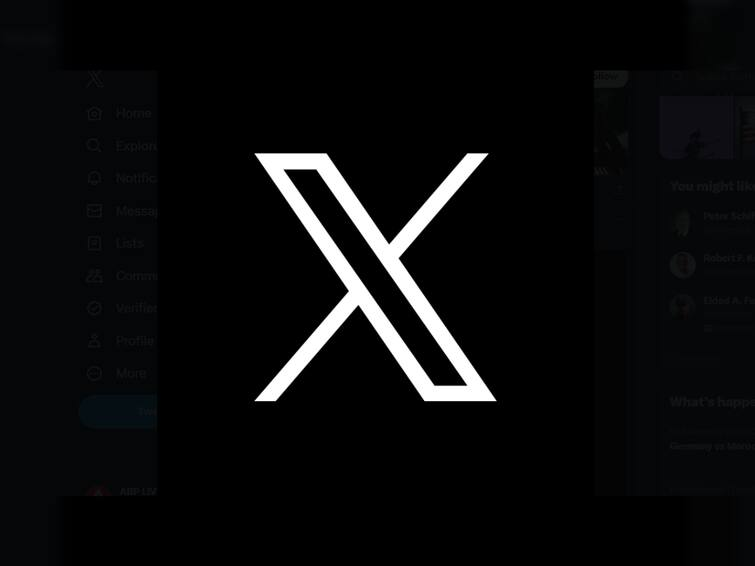

### Hi there 👋 I'm Nick DeMarco

A software engineer; a science nerd; a musician. 

- 🔭 I currently work for Innovid (formerly Flashtalking).
- 🌱 I’m currently learning Kotlin Multiplatform and how to balance fatherhood, work, fitness, and my passion projects.
- 💬 Ask me about Kotlin or Ktor!
- 📫 How to reach me:  
- ⚡ Fun fact: I was the winner of my first grade spelling bee.
